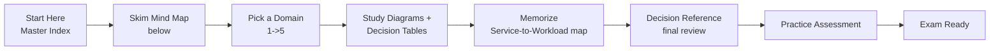
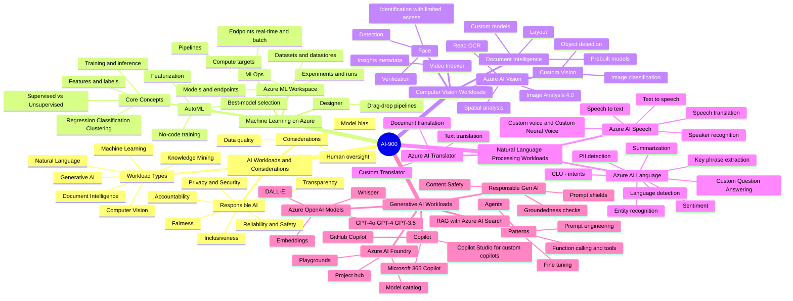
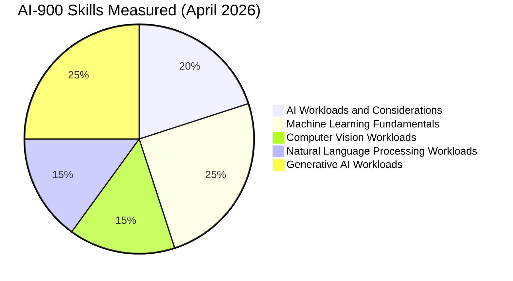
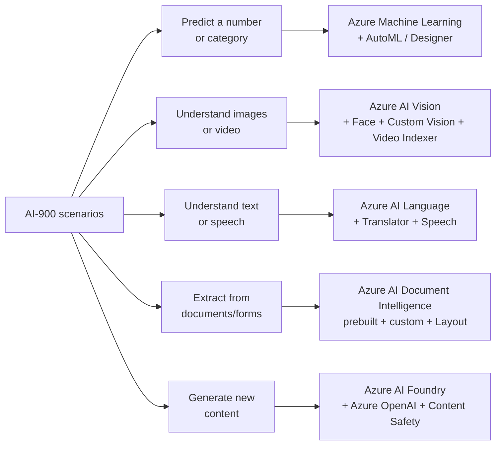
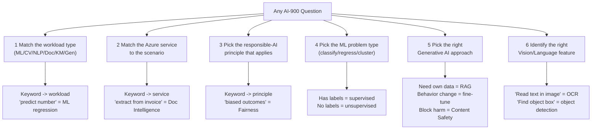
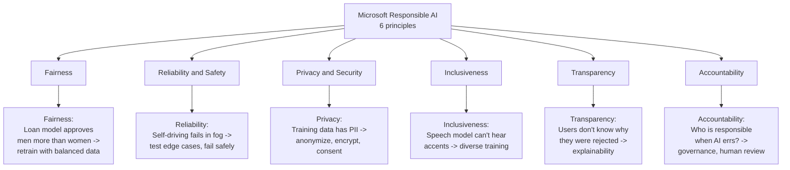
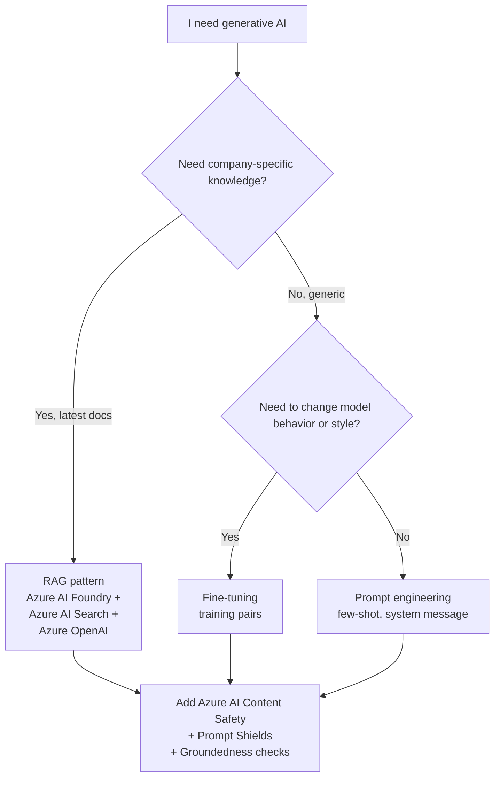

# AI-900 Visual Study Guide - Master Index

> **Microsoft Azure AI Fundamentals**
> Concept-only study layer. Aligned to the official [AI-900 study guide](https://learn.microsoft.com/credentials/certifications/resources/study-guides/ai-900) (skills measured as of **April 2026**) and the [exam page](https://learn.microsoft.com/credentials/certifications/exams/ai-900/). No exam questions reproduced.

AI-900 is the **fundamentals exam** - recognition over implementation. You need to know **what each Azure AI capability does, when to pick it, and what responsible-AI principle applies**, not how to code it.

---

## How to use this guide

---

## The 5 Exam Domains - Mind Map

---

## Official skills weighting

| # | Domain | Weight | File |
|---|---|---|---|
| 1 | AI Workloads and Considerations | **20%** | [01-ai-workloads.md](01-ai-workloads.md) |
| 2 | Fundamentals of Machine Learning | **20-25%** | [02-ml-fundamentals.md](02-ml-fundamentals.md) |
| 3 | Computer Vision Workloads | **15-20%** | [03-computer-vision.md](03-computer-vision.md) |
| 4 | Natural Language Processing Workloads | **15-20%** | [04-nlp.md](04-nlp.md) |
| 5 | Generative AI Workloads | **20-25%** | [05-generative-ai.md](05-generative-ai.md) |
| | **Exam Decision Reference** | - | [05-exam-cheatsheet.md](05-exam-cheatsheet.md) |
| | **Concept & Reference Index** | - | [06-references.md](06-references.md) |
| + | **Extra Concepts** | - | [07-extra-ai900-concepts.md](07-extra-ai900-concepts.md) |
| + | **Microsoft Learn Summaries** | - | [08-learn-summaries.md](08-learn-summaries.md) |
| + | **AI Architectures - AI-900** | - | [09-arch-ai900.md](09-arch-ai900.md) |

---

## Service-to-workload quick map

The smallest set of services to memorize: **Azure Machine Learning, Azure AI Vision, Azure AI Language, Azure AI Speech, Azure AI Translator, Azure AI Document Intelligence, Azure AI Search, Azure AI Foundry, Azure OpenAI, Azure AI Content Safety, Custom Vision, Face, Video Indexer.**

---

## The 6 Question Patterns You Will See

---

## The "Magic Words" Translator (AI-900 -> Service)

| When the question says... | Pick this service / capability | Why |
|---|---|---|
| "extract printed or handwritten text from an image" | **Azure AI Vision - Read API (OCR)** | OCR is the Read feature, not a separate service. |
| "describe an image, generate captions, detect objects" | **Azure AI Vision - Image Analysis 4.0** | New Vision umbrella feature. |
| "identify a specific person from a photo" | **Azure AI Face** (limited-access) | Verification/identification needs Face. |
| "classify images into custom categories my company defines" | **Custom Vision** (image classification) | Custom Vision = your own labels. |
| "find bounding boxes for products on a shelf" | **Custom Vision** (object detection) | Object detection = box + class. |
| "transcribe a meeting recording" | **Azure AI Speech - Speech to Text** | Real-time or batch transcription. |
| "convert app text into spoken audio" | **Azure AI Speech - Text to Speech** | Optionally Custom Neural Voice for branded voice. |
| "translate documents while keeping formatting" | **Azure AI Translator - Document Translation** | Document Translation preserves layout. |
| "detect language and sentiment of customer reviews" | **Azure AI Language** | Language detection + sentiment analysis features. |
| "understand intent of a chatbot user" | **Azure AI Language - CLU** | Conversational Language Understanding (replaces LUIS). |
| "FAQ-style question answering over a doc set" | **Azure AI Language - Custom Question Answering** | Replaces QnA Maker. |
| "extract fields from invoices, receipts, ID cards" | **Azure AI Document Intelligence** (prebuilt) | Prebuilt invoice/receipt/ID models. |
| "extract fields from custom forms my company uses" | **Azure AI Document Intelligence - Custom model** | Train on your own form layout. |
| "search across PDFs, images, audio with metadata" | **Azure AI Search + skillsets** | Knowledge mining pattern. |
| "build a chatbot that uses my company docs" | **Azure AI Foundry + Azure OpenAI + Azure AI Search (RAG)** | Standard RAG pattern. |
| "generate marketing copy / images / code" | **Azure OpenAI** (GPT/DALL-E) via Foundry | Generative AI workload. |
| "block prompts that try to jailbreak my model" | **Azure AI Content Safety - Prompt Shields** | Detects jailbreak attempts. |
| "filter harmful content the model produces" | **Azure AI Content Safety** | Hate, sexual, violence, self-harm filtering. |
| "team can build copilots without code" | **Microsoft Copilot Studio** | Low-code copilot builder. |
| "predict a continuous value (price, temperature)" | **ML - Regression** | Regression = number. |
| "predict a category (spam / not spam)" | **ML - Classification** | Classification = label. |
| "group similar customers without labels" | **ML - Clustering** | Unsupervised, no labels needed. |
| "team has no ML expertise but wants to train a model" | **Azure ML - AutoML** | No-code automated training. |
| "drag-drop visual ML pipeline" | **Azure ML - Designer** | Visual pipeline editor. |

---

## Responsible AI - the 6 principles you must memorize

| Principle | One-line trigger | Example exam keyword |
|---|---|---|
| **Fairness** | Equal treatment across groups | "biased against gender / ethnicity" |
| **Reliability & Safety** | Works as intended, fails gracefully | "edge cases", "consistent results" |
| **Privacy & Security** | Protect data + model | "personal data", "sensitive info" |
| **Inclusiveness** | Works for everyone, including disabilities | "accessibility", "underrepresented" |
| **Transparency** | Users understand what AI does and limits | "explain why", "interpretability" |
| **Accountability** | Humans stay in charge | "who is responsible", "human oversight" |

---

## ML problem-type decision tree

```mermaid
flowchart TD
    Q[I have a problem]
    Q --> HasLabels{Do I have labeled data?}
    HasLabels -- Yes --> Sup[Supervised learning]
    HasLabels -- No --> Unsup[Unsupervised learning]
    HasLabels -- "Reward signal only" --> RL[Reinforcement learning]

    Sup --> NumOrCat{Predicting number or category?}
    NumOrCat -- Number --> Reg[Regression<br/>price, age, demand]
    NumOrCat -- Category --> Cls[Classification<br/>spam, churn, fraud]

    Unsup --> Pat{What pattern?}
    Pat -- Group similar --> Clu[Clustering<br/>customer segments]
    Pat -- Reduce dimensions --> Dim[Dimensionality reduction<br/>PCA-style]
    Pat -- Find anomalies --> Ano[Anomaly detection]
```

---

## Generative AI decision tree

---

## Top "gotchas"

- **Document Intelligence != AI Vision.** Vision Read OCR returns raw text. Document Intelligence returns **structured fields** (invoice total, vendor, line items).
- **Custom Vision != AI Vision.** AI Vision Image Analysis is **prebuilt** (cats, cars, captions). Custom Vision is **your own classes**.
- **Speech *Translation* vs Translator.** Speech Translation = audio->text->audio in another language. Translator = text->text.
- **CLU vs Custom Question Answering.** CLU = intent + entities (book a flight). CQA = FAQ (what is your return policy?).
- **Azure AI Foundry is the new home for generative AI.** It replaced Azure AI Studio. The model catalog, playgrounds, and project hub all live here.
- **Form Recognizer is now Azure AI Document Intelligence.** Old name still appears in older Learn modules - pick the new name on the exam.
- **GPT models live in Azure OpenAI** but you access them via Foundry now.
- **Content Safety, Prompt Shields, Groundedness** are different features of the same service.

---

## Supporting pages in this guide

| File | Purpose |
|---|---|
| [05-exam-cheatsheet.md](05-exam-cheatsheet.md) | All decision trees + "magic words" translator in one printable page |
| [06-references.md](06-references.md) | Every concept linked to Microsoft Learn |
| [07-extra-ai900-concepts.md](07-extra-ai900-concepts.md) | Edge-case concepts (RL, anomaly detection, Custom Neural Voice, MLOps) |
| [08-learn-summaries.md](08-learn-summaries.md) | Per-service summary matching Microsoft Learn module headlines |
| [09-arch-ai900.md](09-arch-ai900.md) | Reference architectures - RAG chatbot, MLOps, knowledge mining |
| [11-microsoft-resources.md](11-microsoft-resources.md) | Curated link library |
| [12-glossary.md](12-glossary.md) | Glossary + acronyms |
| [13-flashcards.md](13-flashcards.md) | Click-to-flip active recall flashcards |
| [14-pitfalls.md](14-pitfalls.md) | Common exam traps |
| [15-hands-on-labs.md](15-hands-on-labs.md) | Free Microsoft Learn sandbox labs |
| [16-architecture-center.md](16-architecture-center.md) | Architecture Center patterns |
| [17-copilot-quiz.md](17-copilot-quiz.md) | AI Copilot practice exam launcher |
| [99-video-tutorials.md](99-video-tutorials.md) | Video walkthroughs |
| [99-practice-assessment.md](99-practice-assessment.md) | Official Microsoft practice link |

---

**Next:** open [01-ai-workloads.md ->](01-ai-workloads.md)
