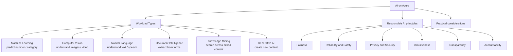
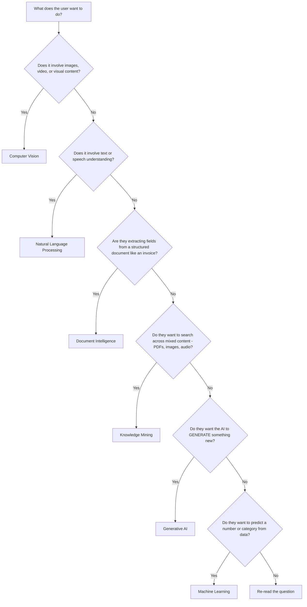
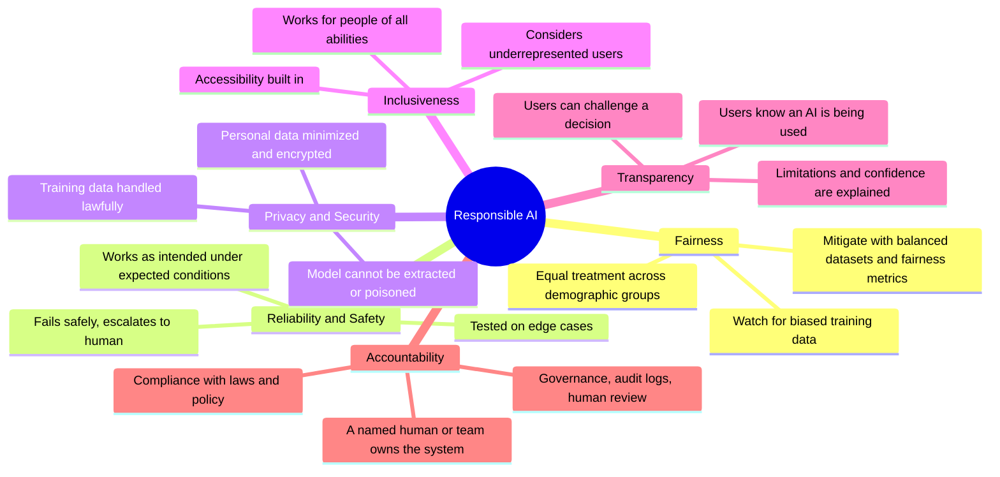
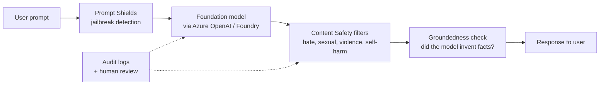

# 1 - AI Workloads and Considerations

> Domain 1 of AI-900. Weight: **20%**. The "what kind of AI is this and what could go wrong" domain. No code - just recognition.

## Skills measured

- **Identify common AI workloads** - content moderation/personalization, computer vision, NLP, document intelligence, knowledge mining, generative AI.
- **Identify guiding principles for Responsible AI** - fairness, reliability and safety, privacy and security, inclusiveness, transparency, accountability.

> Source: [AI-900 study guide](https://learn.microsoft.com/credentials/certifications/resources/study-guides/ai-900) (skills measured as of April 2026).

---

## Concept map

---

## The 6 workload types - what each one *does*

| Workload | What it does | Azure service(s) | Example scenario |
|---|---|---|---|
| **Machine Learning** | Predict a value or category from past data | Azure Machine Learning, AutoML, Designer | Predict customer churn, forecast demand |
| **Computer Vision** | Interpret images and video | Azure AI Vision, Custom Vision, Face, Video Indexer | Read text from photos, detect defects on production line |
| **Natural Language Processing** | Understand or generate text/speech | Azure AI Language, Translator, Speech | Sentiment analysis, transcription, chatbot intent |
| **Document Intelligence** | Extract structured fields from documents | Azure AI Document Intelligence | Auto-process invoices, IDs, receipts |
| **Knowledge Mining** | Index and search heterogeneous content | Azure AI Search + skillsets | Search across PDFs, images, audio metadata |
| **Generative AI** | Create new text, images, code, audio | Azure AI Foundry + Azure OpenAI | Draft emails, generate marketing copy or images |

> **Decision rule:** read the verb in the question.
> *Predict / classify* -> ML. *Look at / read image* -> CV. *Read text input* -> NLP. *Pull fields from form* -> Doc Intelligence. *Search across* -> Knowledge Mining. *Create / generate* -> Generative AI.

---

## Workload classifier - decision tree

---

## Responsible AI - Microsoft's 6 principles

### Principle -> keyword cheat table

| Principle | Trigger keywords in the question | Mitigation |
|---|---|---|
| **Fairness** | "biased", "discriminates", "treats group X worse", "loan/hiring outcomes vary by gender or ethnicity" | Balanced training data, fairness assessment toolkit, sensitive-feature analysis |
| **Reliability & Safety** | "unsafe", "edge cases", "fails in fog/at night", "inconsistent results", "fails gracefully" | Testing, monitoring, fallback paths, human-in-the-loop |
| **Privacy & Security** | "personal data", "PII", "consent", "leakage", "stolen model" | Anonymize, encrypt, RBAC, private endpoints, differential privacy |
| **Inclusiveness** | "accessibility", "disabilities", "different accents", "underrepresented users" | Diverse training data, accessibility tooling, multimodal interfaces |
| **Transparency** | "users don't know why", "explain decision", "interpretability", "cannot understand model output" | Model interpretability, model cards, plain-language explanations |
| **Accountability** | "who is responsible", "governance", "human oversight", "compliance" | RACI, governance review, audit logs, human review of high-impact decisions |

> **Common trap:** "the model produces harmful content" can map to either **Reliability & Safety** *or* **Accountability** depending on framing. Microsoft Learn maps user-facing safety to **Reliability & Safety**, and "who is in charge of fixing it" to **Accountability**. Read carefully.

---

## Worked examples - pick the principle

| Scenario | Principle | Why |
|---|---|---|
| A resume-screening AI rejects female applicants more than male ones with similar resumes. | **Fairness** | Outcomes differ by demographic group. |
| A self-driving prototype works well in clear weather but freezes in heavy rain. | **Reliability & Safety** | Fails in real-world edge case. |
| A health chatbot stores conversation transcripts unencrypted. | **Privacy & Security** | Sensitive data not protected. |
| A speech-to-text system has poor accuracy for users with strong regional accents. | **Inclusiveness** | Doesn't work for all users. |
| A loan-approval model gives a yes/no with no explanation of the factors. | **Transparency** | Users cannot understand or challenge. |
| When the AI errs, no one in the company is sure who must fix or audit it. | **Accountability** | No clear ownership. |

---

## Generative-AI-specific responsible-AI patterns

| Concern | Built-in Azure mitigation |
|---|---|
| Jailbreak / prompt injection | **Azure AI Content Safety - Prompt Shields** |
| Model produces harmful content | **Azure AI Content Safety** filters (hate / sexual / violence / self-harm) |
| Model hallucinates / fabricates facts | **Groundedness detection** in Content Safety + RAG with cited sources |
| Toxic words list per company | **Custom blocklists** in Content Safety |
| Need to log who used what prompt | **Azure Monitor + diagnostic settings** on Foundry / Azure OpenAI |

---

## Common AI considerations (non-exhaustive)

| Consideration | Concrete AI-900 implication |
|---|---|
| **Data quality** | Garbage in, garbage out. Cleaned, balanced, recent data is mandatory before training. |
| **Bias** | Training data must reflect the population the model serves; otherwise unfair outcomes. |
| **Interpretability** | Some models (linear, decision trees) are inherently interpretable; deep models need explainers (SHAP, etc.). |
| **Human oversight** | Critical decisions (medical, legal, hiring) require human-in-the-loop. |
| **Cost** | Generative models are billed per token. Smaller models are cheaper but less capable. |
| **Latency** | Real-time chat needs streamed responses; batch tasks can use slower, cheaper paths. |
| **Compliance** | Sector rules (HIPAA, GDPR, PCI) constrain where data can live and what models can see. |

---

## Microsoft Learn modules for this domain

- [Get started with AI on Azure](https://learn.microsoft.com/training/modules/get-started-ai-fundamentals/)
- [Fundamentals of AI in Microsoft Azure](https://learn.microsoft.com/training/paths/get-started-with-artificial-intelligence-on-azure/)
- [Identify guiding principles for responsible AI](https://learn.microsoft.com/training/modules/responsible-generative-ai/)
- [Foundations of generative AI](https://learn.microsoft.com/training/modules/fundamentals-generative-ai/)

---

[<- Master Index](00-MASTER-INDEX.md) - [Machine Learning on Azure ->](02-ml-fundamentals.md)
