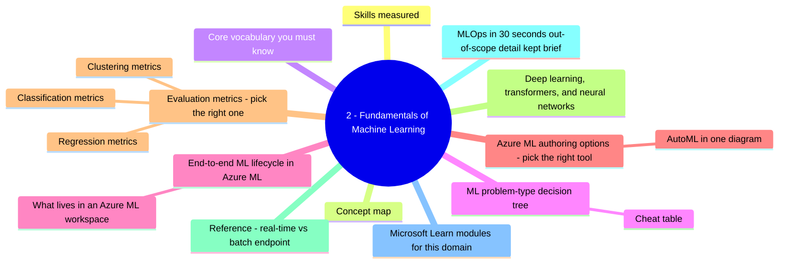
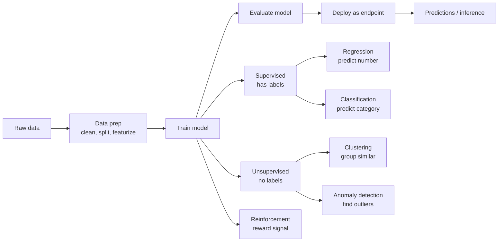
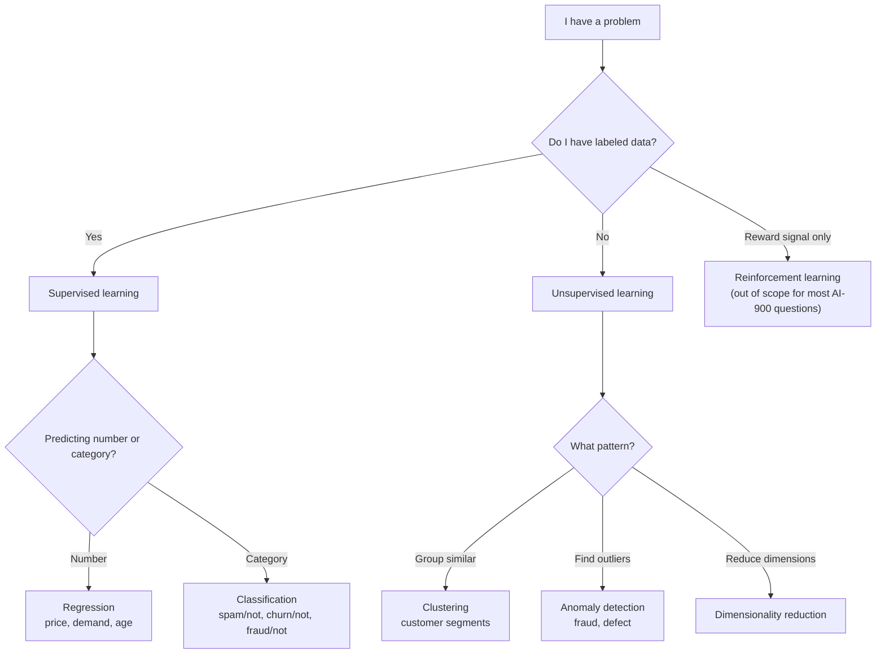
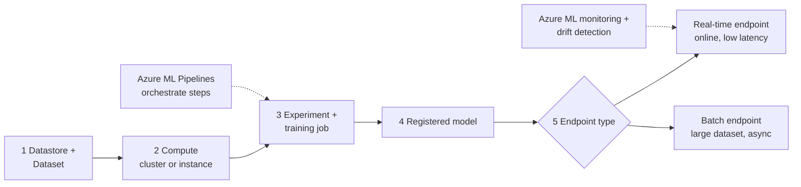
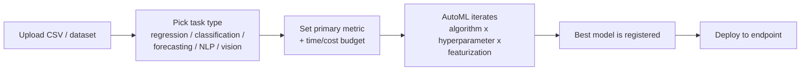
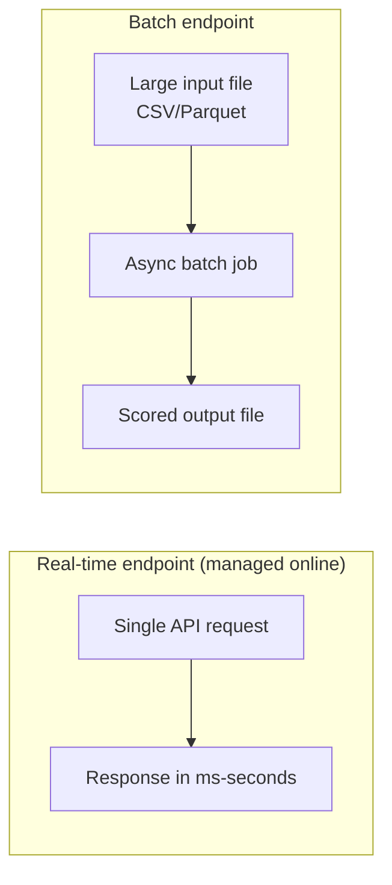
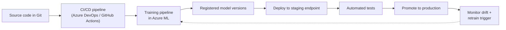

# 2 - Fundamentals of Machine Learning

> Domain 2 of AI-900. Weight: **20-25%**. The "what kind of ML problem is this and what tool in Azure ML do I use" domain.

## Domain mind map

## Skills measured

- **Identify common ML types** - regression, classification, clustering, deep learning, transformers.
- **Describe core ML concepts** - features, labels, training, validation, inference.
- **Identify core tasks in creating an ML solution** - data ingestion and prep, feature engineering, model training and evaluation, deployment.
- **Describe capabilities of Azure Machine Learning** - workspace, compute, AutoML, Designer, pipelines, MLOps.

> Source: [AI-900 study guide](https://learn.microsoft.com/credentials/certifications/resources/study-guides/ai-900).

---

## Concept map

---

## Core vocabulary you must know

| Term | Plain definition |
|---|---|
| **Feature** | An input column. e.g., `age`, `income`, `previous_purchases`. |
| **Label** | The target column the model predicts. e.g., `will_churn` (yes/no), `price`. |
| **Training data** | Rows used to fit the model. Labels included for supervised learning. |
| **Validation data** | Held out during training; used to tune hyperparameters. |
| **Test data** | Held out completely; final unbiased evaluation. |
| **Inference / scoring** | Using the trained model to predict on new data. |
| **Endpoint** | A deployed model accessible via an API. **Real-time** = low-latency single requests. **Batch** = score a large file. |
| **Hyperparameter** | A model setting tuned before training (learning rate, tree depth). |
| **Overfitting** | Model memorizes training data and fails on new data. Mitigate with more data, regularization, simpler models. |
| **Underfitting** | Model is too simple; misses real patterns. Mitigate with richer features or more capacity. |

---

## ML problem-type decision tree

### Cheat table

| Question wording | Pick |
|---|---|
| "predict house price / demand / temperature" | **Regression** (number) |
| "is this email spam? / will this customer churn?" | **Classification** (category) |
| "spot unusual credit-card activity" | **Anomaly detection** |
| "group customers into segments without predefined labels" | **Clustering** |
| "describe what's in this image" / "translate this text" | **Deep learning / transformers** (not classic ML) |

---

## End-to-end ML lifecycle in Azure ML

### What lives in an Azure ML workspace

| Asset | Role |
|---|---|
| **Datastore** | Pointer to storage (Blob, Data Lake, SQL). |
| **Dataset / Data asset** | Versioned reference to data inside a datastore. |
| **Compute target** | Where training/scoring runs: **Compute instance** (single dev VM), **Compute cluster** (autoscaling training cluster), **Inference cluster** (AKS for real-time), **Attached compute** (your own VM/Databricks). |
| **Environment** | Container image + Python deps for reproducible runs. |
| **Experiment / Job / Run** | One execution of a script with logged metrics. |
| **Registered model** | Versioned trained model artifact. |
| **Endpoint + Deployment** | Deployed model (real-time or batch). |
| **Pipeline** | Multi-step graph (prep -> train -> register -> deploy). |

---

## Azure ML authoring options - pick the right tool

| Tool | Who uses it | When |
|---|---|---|
| **Automated ML (AutoML)** | Business users, citizen data scientists | "I have a CSV; train the best model for me." No code required. |
| **Designer** | Visual learners, no-code | Drag-drop pipeline of components - clean -> split -> train -> evaluate. |
| **Notebooks (SDK / CLI)** | Data scientists | Full control with Python SDK v2 or `az ml` CLI v2. |
| **Prompt flow** *(in AI Foundry)* | Gen-AI builders | Visual flow for LLM apps - out of AI-900 scope but shows on the boundary of ML and Gen AI. |

### AutoML in one diagram

---

## Evaluation metrics - pick the right one

### Regression metrics

| Metric | What it measures | Lower / higher is better |
|---|---|---|
| **MAE** Mean Absolute Error | Average size of error | Lower |
| **RMSE** Root Mean Squared Error | Penalizes big errors more | Lower |
| **R^2** | Fraction of variance explained | Higher (1.0 is perfect) |

### Classification metrics

| Metric | What it measures |
|---|---|
| **Accuracy** | Overall % correct. **Misleading on imbalanced data.** |
| **Precision** | Of items predicted positive, how many were actually positive. ("Don't cry wolf.") |
| **Recall (sensitivity)** | Of actual positives, how many were caught. ("Catch all the fraud.") |
| **F1** | Harmonic mean of precision and recall. |
| **AUC / ROC** | How well the model separates classes across thresholds. |
| **Confusion matrix** | Table of TP / FP / TN / FN. |

### Clustering metrics

- **Inertia / WCSS** - within-cluster sum of squares (lower is tighter).
- **Silhouette score** - how well-separated the clusters are (higher is better).

> **Common trap:** "the model is 99% accurate but misses every fraud case" - accuracy is **misleading**; pick **recall** or **F1** for imbalanced problems.

---

## Deep learning, transformers, and neural networks

| Concept | Plain definition | AI-900 scope |
|---|---|---|
| **Neural network** | Layers of weighted connections that learn non-linear patterns. | Recognize the term. |
| **Deep learning** | Neural networks with many layers. Powers vision, speech, NLP. | Know it's the engine behind modern AI. |
| **Transformer** | Architecture using "attention" - backbone of GPT, BERT, modern LLMs. | Know it powers GPT and Azure OpenAI models. |
| **Embedding** | Vector representation of a word / image / item used for similarity search. | Foundation of RAG and semantic search. |
| **Foundation model** | Large pretrained model (e.g., GPT-4o) that can be adapted for many tasks. | Know it's the base layer used in Azure AI Foundry. |

---

## Reference: real-time vs batch endpoint

| Need | Pick |
|---|---|
| Per-user prediction in a website | **Real-time endpoint** |
| Score 50 million rows overnight | **Batch endpoint** |
| Predictable cost, low traffic | **Real-time** with min instances 1 |
| Rare prediction job, no SLA | **Batch** (cheapest) |

---

## MLOps in 30 seconds (out-of-scope detail kept brief)

AI-900 doesn't expect you to **build** an MLOps pipeline; just recognize that Azure ML supports versioned models, automated retraining, and CI/CD integration.

---

## Microsoft Learn modules for this domain

- [Fundamentals of machine learning](https://learn.microsoft.com/training/modules/fundamentals-machine-learning/)
- [Fundamentals of Azure Machine Learning](https://learn.microsoft.com/training/modules/fundamentals-machine-learning-on-azure/)
- [Use Automated Machine Learning in Azure ML](https://learn.microsoft.com/training/modules/use-automated-machine-learning/)

---

[<- AI Workloads](01-ai-workloads.md) - [Computer Vision Workloads ->](03-computer-vision.md)
