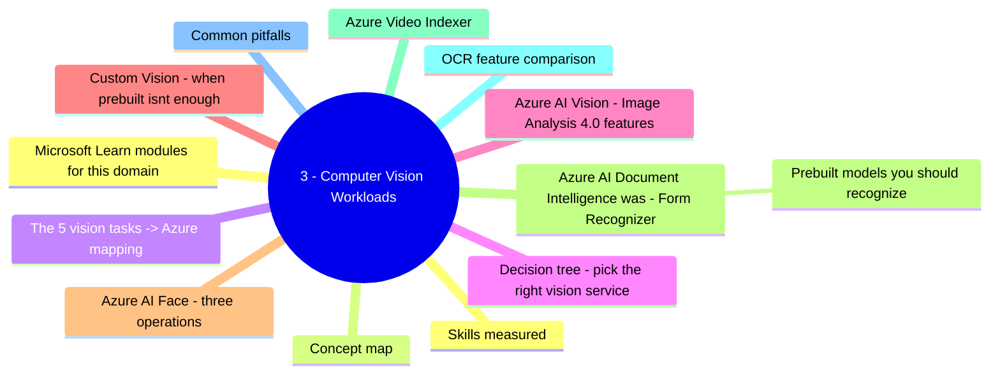
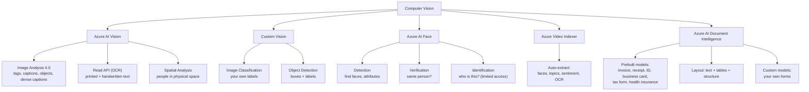
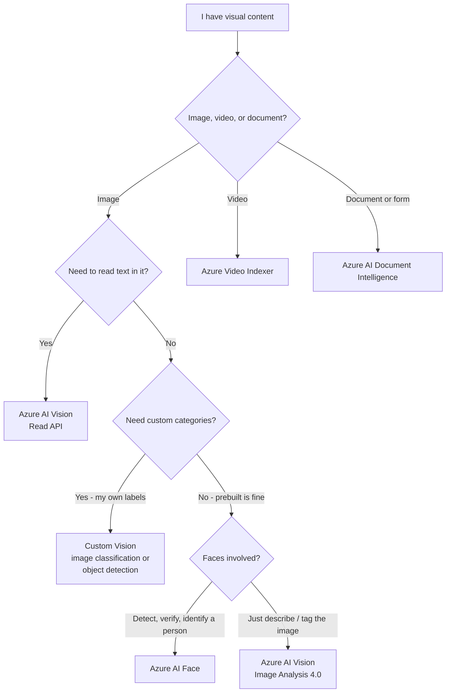
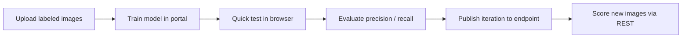
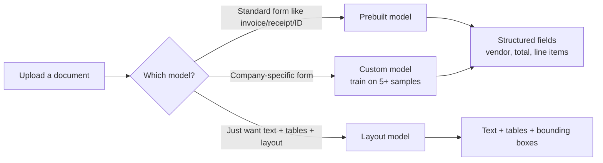
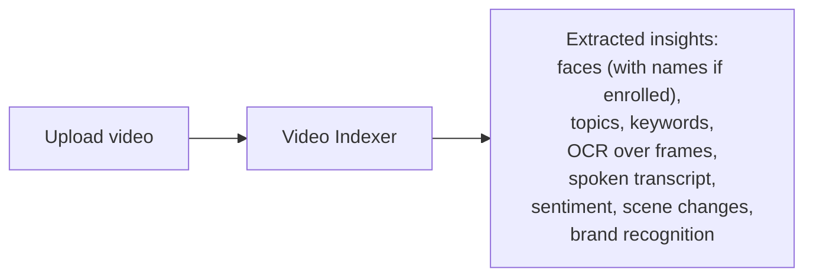

# 3 - Computer Vision Workloads

> Domain 3 of AI-900. Weight: **15-20%**. The "image and video" domain. Goal: match each scenario to the right Azure AI Vision feature or sibling service (Custom Vision, Face, Video Indexer, Document Intelligence).

## Domain mind map

## Skills measured

- **Identify common types of computer vision solution** - image classification, object detection, OCR, facial detection / recognition.
- **Identify Azure tools and services for computer vision tasks** - Azure AI Vision, Custom Vision, Face, Video Indexer, Azure AI Document Intelligence.

> Source: [AI-900 study guide](https://learn.microsoft.com/credentials/certifications/resources/study-guides/ai-900).

---

## Concept map

---

## The 5 vision tasks -> Azure mapping

| Task | What it produces | Azure service |
|---|---|---|
| **Image classification** | Whole-image labels with confidence | **Azure AI Vision - Image Analysis** (prebuilt) or **Custom Vision** (your labels) |
| **Object detection** | Bounding boxes + labels | **Azure AI Vision - Image Analysis 4.0** or **Custom Vision** |
| **OCR (Read text in image)** | Text strings + bounding lines | **Azure AI Vision - Read API** |
| **Face detection / recognition** | Face boxes, attributes, identity match | **Azure AI Face** |
| **Form / document field extraction** | Structured key-value pairs, tables | **Azure AI Document Intelligence** |
| **Video insights** | Topics, faces, OCR, sentiment over time | **Azure Video Indexer** |

---

## Decision tree - pick the right vision service

---

## Azure AI Vision - Image Analysis 4.0 features

| Feature | What it returns |
|---|---|
| **Tags** | Single-word labels for the whole image. |
| **Caption** | Single-sentence description. |
| **Dense captions** | Captions for **regions** of the image. |
| **Objects** | Bounding boxes + labels for general objects. |
| **People** | Bounding boxes for people (no identity). |
| **Smart crops** | Suggested crop rectangles for thumbnails. |
| **Read** | OCR - printed and handwritten text. |
| **Background removal** | Cutout the foreground subject. |

> All prebuilt; no training.

---

## Custom Vision - when prebuilt isn't enough

| Decision | Custom Vision project type |
|---|---|
| "Tag whole image with one or more **categories my company defines**" | **Image classification** |
| "Find **bounding boxes** of products / defects" | **Object detection** |
| "Detect a **specific person**" | Use **Face**, not Custom Vision |
| "Read printed text" | Use **AI Vision Read**, not Custom Vision |

---

## Azure AI Face - three operations

| Operation | What it does | Need |
|---|---|---|
| **Detection** | Find face rectangles + attributes (head pose, accessories). | Open access. |
| **Verification (1:1)** | "Are these two faces the same person?" | Open access. |
| **Identification (1:N)** | "Which enrolled person is this?" | **Limited Access** - must apply for approval. |
| **Liveness** | Anti-spoofing - is this a real person? | Limited Access. |

> The Face *attribute* feature (gender, emotion, age, smile) was **retired** in 2022. Don't pick it as an answer.

---

## Azure AI Document Intelligence (was: Form Recognizer)

### Prebuilt models you should recognize

| Prebuilt | Extracts |
|---|---|
| **Invoice** | Invoice ID, vendor, customer, line items, totals |
| **Receipt** | Merchant, items, total, tax |
| **ID document** | Name, DOB, ID number, expiration |
| **Business card** | Name, company, phone, email |
| **W-2 / tax form** | Employer, wages, withholding (US) |
| **Health insurance card** | Member ID, group, plan |
| **Layout** | Text + tables + selection marks |
| **Read (OCR)** | Plain text, no field structure |

> **Trap:** "extract printed text from a receipt photo" - both **AI Vision Read** and **Document Intelligence Read** return raw text, but the exam expects **Document Intelligence prebuilt-receipt** when fields like merchant, total, and date are needed.

---

## Azure Video Indexer

| Use case | Match |
|---|---|
| "Auto-generate captions and chapters for a meeting recording" | **Video Indexer** |
| "Index Olympic broadcasts to find every shot of Team A" | **Video Indexer** |

---

## OCR feature comparison

| Feature | AI Vision Read | Document Intelligence Read | Document Intelligence Prebuilt |
|---|---|---|---|
| Plain printed + handwritten text | y | y | y |
| Page layout + tables | - | partial | y (Layout) |
| Structured fields (totals, vendor) | - | - | y (Invoice, Receipt, ID, ...) |
| Custom fields | - | - | y (Custom model) |

---

## Common pitfalls

- **Image Analysis != Custom Vision.** Image Analysis = prebuilt categories. Custom Vision = your own categories.
- **Face attribute prediction (gender, emotion) is deprecated.** Don't pick it.
- **Face Identification is Limited Access.** Mention of "approved use case" is a hint.
- **Document Intelligence is the new Form Recognizer.** Old name still appears in older Learn material.
- **OCR / Read** is a *feature*, not a separate service - it lives in **Azure AI Vision**.
- **Video Indexer** is for full-video insights; for a single frame, use Image Analysis.

---

## Microsoft Learn modules for this domain

- [Fundamentals of computer vision](https://learn.microsoft.com/training/modules/fundamentals-computer-vision/)
- [Analyze images with Azure AI Vision](https://learn.microsoft.com/training/modules/analyze-images/)
- [Read text with Azure AI Vision](https://learn.microsoft.com/training/modules/read-text-images-documents-with-computer-vision-service/)
- [Detect, analyze, and recognize faces](https://learn.microsoft.com/training/modules/detect-analyze-recognize-faces/)
- [Analyze receipts with the Document Intelligence service](https://learn.microsoft.com/training/modules/analyze-receipts-form-recognizer/)

---

[<- ML Fundamentals](02-ml-fundamentals.md) - [Natural Language Processing ->](04-nlp.md)
