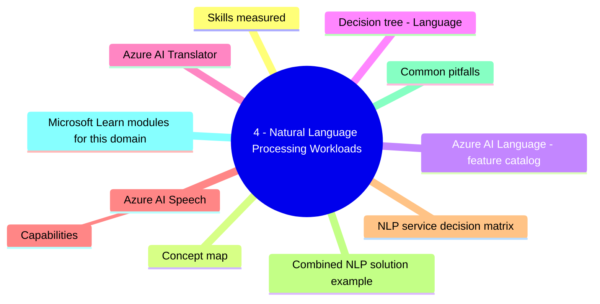
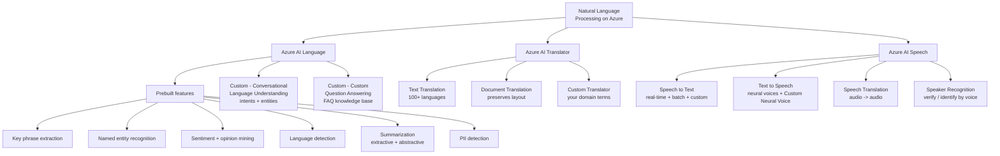
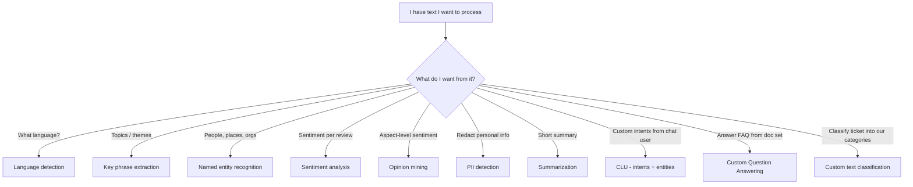
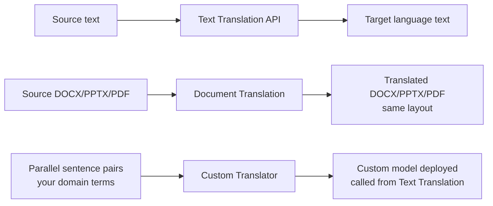
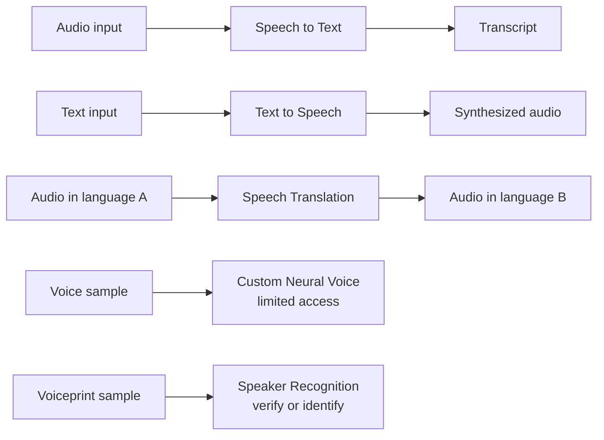
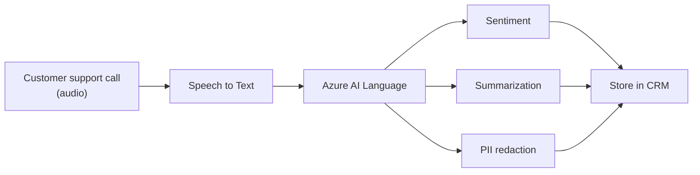

# 4 - Natural Language Processing Workloads

> Domain 4 of AI-900. Weight: **15-20%**. Text + speech understanding. Memorize which **feature of Azure AI Language / Translator / Speech** matches each scenario.

## Domain mind map

## Skills measured

- **Identify features of common NLP workload scenarios** - sentiment, entities, language detection, summarization, key phrases, PII, question answering, conversational language understanding, translation, transcription.
- **Identify Azure services for NLP** - Azure AI Language, Azure AI Translator, Azure AI Speech.

> Source: [AI-900 study guide](https://learn.microsoft.com/credentials/certifications/resources/study-guides/ai-900).

---

## Concept map

---

## Azure AI Language - feature catalog

| Feature | What it returns | Trigger keyword |
|---|---|---|
| **Key phrase extraction** | Main concepts in text | "key topics", "what is this about" |
| **Named Entity Recognition (NER)** | Categorized entities (Person, Organization, Location, Event, Quantity, ...) | "extract people / places / orgs" |
| **Linked entities** | Entities + Wikipedia/knowledge-base link | "disambiguate", "Apple the company vs the fruit" |
| **PII detection** | Detect/redact personal info | "redact SSN", "remove PII" |
| **Sentiment analysis** | Positive / neutral / negative + confidence | "analyze customer reviews" |
| **Opinion mining** | Aspect-level sentiment ("food: positive, service: negative") | "what do customers think about \<feature>" |
| **Language detection** | ISO code + confidence | "what language is this", "auto-route to translator" |
| **Summarization** | **Extractive** (pick sentences) or **abstractive** (rephrase) | "summarize this article" |
| **Conversational summarization** | Summaries of chat / call transcripts | "summarize the call" |
| **Custom NER / Custom text classification** | Your own entity types or categories | "classify support tickets into our queues" |
| **CLU - Conversational Language Understanding** | Predict **intent** + extract **entities** from utterance | "book a flight from Seattle to New York" |
| **Custom Question Answering** | Answer a question from your KB | "What is the return policy?" -> answer from FAQ |

> **CLU replaces LUIS.** **Custom Question Answering replaces QnA Maker.** Pick the new names on the exam.

---

## Decision tree - Language

---

## Azure AI Translator

| Feature | Use |
|---|---|
| **Text Translation** | API for translating strings; auto-detect supported. |
| **Document Translation** | Translate full files **while preserving formatting**. |
| **Custom Translator** | Train domain-specific model with parallel data; called by Text Translation API. |
| **Transliteration** | Convert script (e.g., Hindi text in Latin script) without translating meaning. |

---

## Azure AI Speech

### Capabilities

| Capability | Use |
|---|---|
| **Speech to Text (STT)** | Real-time and batch transcription. **Custom Speech** lets you tune for jargon/accents. |
| **Text to Speech (TTS)** | 400+ neural voices across 100+ languages. **Custom Neural Voice** for branded voice (limited access). |
| **Speech Translation** | Translate speech to speech (or text) across many languages. |
| **Speaker Recognition** | **Verification (1:1)** or **identification (1:N)** by voice. |
| **Pronunciation assessment** | Score language-learner pronunciation. |
| **Keyword spotting** | "Hey Cortana" / wake-word detection. |

> **Speech Translation != Translator.** Speech Translation handles audio. Translator handles text/files.

---

## NLP service decision matrix

| Scenario | Pick |
|---|---|
| Detect language of incoming customer email | **Language detection** (Azure AI Language) |
| Extract product names mentioned in tweets | **Named Entity Recognition** |
| Classify support tickets into "Billing / Tech / Sales" | **Custom text classification** |
| Build a chatbot that books flights and understands cities/dates | **CLU** (intents + entities) |
| Build an FAQ bot from a support PDF | **Custom Question Answering** |
| Translate a 100-page contract while keeping page formatting | **Document Translation** |
| Translate domain-specific medical terms accurately | **Custom Translator** |
| Real-time captions in a Teams call | **Speech to Text** (real-time) |
| Brand-specific voice for the IVR system | **Custom Neural Voice** |
| Verify caller identity by voice | **Speaker Verification** |
| Translate spoken English speech to spoken Spanish | **Speech Translation** |

---

## Combined NLP solution example

> Many real systems chain **Speech -> Language**: transcribe call, then run sentiment + summarization + PII redaction before storing.

---

## Common pitfalls

- **CLU vs Custom Question Answering.** CLU = predict an *intent* and extract *entities* from a user utterance. CQA = match a user *question* to a stored *answer*.
- **CLU replaces LUIS.** Custom Question Answering replaces QnA Maker.
- **Speech *Translation* lives in Azure AI Speech**, not Translator.
- **Custom Neural Voice is Limited Access** - needs Microsoft approval.
- **Custom Translator builds models that Text Translation calls** - there is no separate "custom translation API".
- **Sentiment != opinion mining.** Sentiment = whole-text. Opinion mining = aspect-level sentiment.
- **Document Translation preserves formatting**; Text Translation handles strings only.

---

## Microsoft Learn modules for this domain

- [Fundamentals of Text Analysis with the Language Service](https://learn.microsoft.com/training/modules/analyze-text-with-text-analytics-service/)
- [Fundamentals of question answering with the Language Service](https://learn.microsoft.com/training/modules/create-question-answer-solution-ai-language/)
- [Fundamentals of conversational language understanding](https://learn.microsoft.com/training/modules/create-language-understanding-model/)
- [Fundamentals of Azure AI Speech](https://learn.microsoft.com/training/modules/recognize-synthesize-speech/)
- [Fundamentals of language translation](https://learn.microsoft.com/training/modules/translate-text-with-translation-service/)

---

[<- Computer Vision](03-computer-vision.md) - [Generative AI Workloads ->](05-generative-ai.md)
