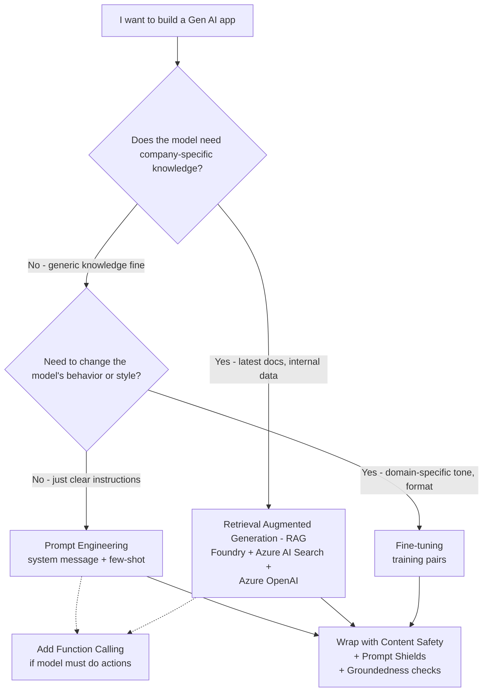
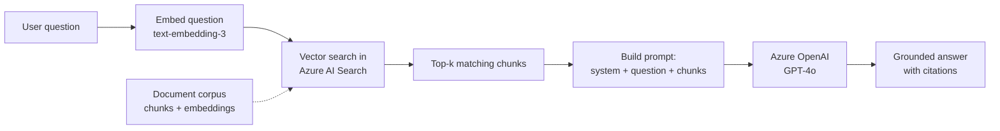
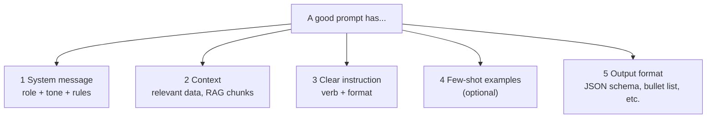
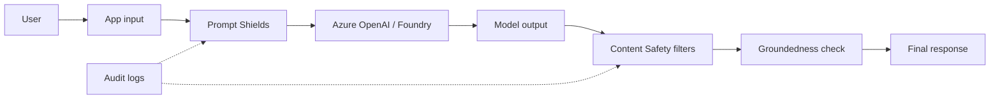

# 5 - Generative AI Workloads

> Domain 5 of AI-900. Weight: **20-25%**. The newest and heaviest domain. You must know **Azure AI Foundry, Azure OpenAI, prompt engineering basics, RAG vs fine-tuning vs prompting, and Content Safety**.

## Skills measured

- **Identify features of generative AI solutions** - language models, prompts, completions, tokens, embeddings.
- **Identify capabilities of Azure AI Foundry and Azure OpenAI** - model catalog, playgrounds, deployments, fine-tuning.
- **Describe responsible AI considerations for generative AI** - content filters, prompt shields, groundedness, hallucination.

> Source: [AI-900 study guide](https://learn.microsoft.com/credentials/certifications/resources/study-guides/ai-900).

---

## Concept map

```mermaid
flowchart TD
    Gen[Generative AI on Azure]

    Gen --> Foundry[Azure AI Foundry]
    Gen --> AOAI[Azure OpenAI Service]
    Gen --> Patterns[Build patterns]
    Gen --> Safety[Responsible Gen AI]
    Gen --> Copilots[Copilots]

    Foundry --> Hub[Hub + Project]
    Foundry --> Catalog[Model catalog]
    Foundry --> Play[Playgrounds:<br/>Chat, Completion, Images, Assistants]
    Foundry --> Eval[Evaluation + tracing]

    AOAI --> GPT[GPT-4o / GPT-4 / GPT-3.5]
    AOAI --> DALLE[DALL-E image generation]
    AOAI --> Whisper[Whisper speech-to-text]
    AOAI --> Embed[Embedding models<br/>text-embedding-3-*]

    Patterns --> PE[Prompt Engineering]
    Patterns --> RAG[Retrieval Augmented Generation]
    Patterns --> FT[Fine-tuning]
    Patterns --> FC[Function calling / Tools]
    Patterns --> Agents[Agents]

    Safety --> CS[Azure AI Content Safety]
    Safety --> PS[Prompt Shields - jailbreak]
    Safety --> GR[Groundedness detection]
    Safety --> BL[Custom blocklists]

    Copilots --> M365[Microsoft 365 Copilot]
    Copilots --> Studio[Microsoft Copilot Studio<br/>build custom copilots]
    Copilots --> GH[GitHub Copilot]
```

---

## Generative AI vocabulary

| Term | Plain definition |
|---|---|
| **Foundation model** | Large pretrained model (e.g., GPT-4o) usable for many tasks. |
| **Large Language Model (LLM)** | Foundation model focused on text. |
| **Token** | Chunk of text the model processes (~3/4 of a word in English). Pricing is per token. |
| **Prompt** | The input you send to the model. |
| **Completion** | The output the model returns. |
| **System message** | Hidden instruction that sets role/style for the whole chat. |
| **Few-shot** | Including 1+ example input/output pairs in the prompt. |
| **Zero-shot** | No examples; just the instruction. |
| **Embedding** | Vector representing meaning of text or images. Used for similarity search and RAG. |
| **Context window** | Max tokens the model can read in one call (e.g., 128K for GPT-4o). |
| **Temperature** | Randomness 0 (deterministic) -> 2 (wild). |
| **Top-p** | Sample from top-probability mass; alternate to temperature. |
| **Hallucination** | Model invents facts confidently. |
| **Grounding** | Forcing the model to answer from retrieved trustworthy data (RAG). |

---

## Azure AI Foundry - what lives in it

| Concept | What it is |
|---|---|
| **Hub** | Shared workspace for collaborative gen-AI development with shared connections, compute, content safety. |
| **Project** | Working folder inside a hub for a specific app. |
| **Model catalog** | Catalog of models from Microsoft, OpenAI, Meta, Mistral, Cohere, NVIDIA, Hugging Face, and more. Filter by task and license. |
| **Playgrounds** | Interactive UIs to try **Chat**, **Completion**, **Image** (DALL-E), and **Assistants** without writing code. |
| **Deployments** | A deployed model + capacity unit (e.g., `gpt-4o-mini` deployed at 30K TPM). |
| **Prompt flow** | Visual editor for chaining prompts, Python tools, and connections - used to build LLM apps. |
| **Evaluations** | Compare model outputs across metrics (groundedness, relevance, coherence). |
| **Tracing** | View token usage, latency, and intermediate steps for each request. |

> Azure AI Foundry **replaced** Azure AI Studio. The model catalog and Azure OpenAI access live here now.

---

## Build pattern decision tree

---

## RAG (Retrieval Augmented Generation) - the canonical pattern

| Why RAG over fine-tuning | |
|---|---|
| Latest data without retraining | RAG y |
| Cite sources | RAG y |
| Cheap, no GPU training | RAG y |
| Change model *style* (always answer like a pirate) | Fine-tune y |
| Compress task-specific behavior into a smaller model | Fine-tune y |

---

## Prompt engineering essentials

| Tip | Why |
|---|---|
| Use a **system message** | Sets persona and hard rules for the whole chat. |
| Be specific about **format** | "Return as JSON with keys X/Y/Z." |
| Provide **examples** for tricky tasks | Few-shot beats zero-shot for niche extraction. |
| Lower **temperature** for factual tasks | 0 -> 0.2 = deterministic. |
| Use **retrieval** to ground answers | Reduces hallucination. |

---

## Azure AI Content Safety - the four building blocks

| Block | What it does |
|---|---|
| **Text moderation** | Filters categories - Hate, Sexual, Violence, Self-harm - at 4 severity levels. |
| **Image moderation** | Same categories for images. |
| **Prompt Shields** | Detect **jailbreak** attempts (user injection) and **document attacks** (poisoned RAG chunks). |
| **Groundedness detection** | Flag when an answer isn't supported by the source documents. |
| **Protected material detection** | Flag potentially copyrighted text/code in completions. |
| **Custom blocklists** | Organization-specific banned terms. |

---

## Copilot ecosystem

| Tier | Product | Who builds it |
|---|---|---|
| **Out-of-box** | Microsoft 365 Copilot, Copilot in Edge, Copilot in Windows | Microsoft (you license + roll out) |
| **Customize / extend** | **Microsoft Copilot Studio** | Low/no-code builders inside org |
| **Build from scratch** | **Azure AI Foundry + Azure OpenAI + Prompt flow** | Developers |
| **Code** | **GitHub Copilot** | Developers via IDE |

> **Trap:** "build a custom copilot for HR without code" -> **Copilot Studio**, not Foundry.

---

## Generative AI scenario -> service mapping

| Scenario | Pick |
|---|---|
| Chatbot grounded on internal HR docs | **Azure AI Foundry + Azure OpenAI + Azure AI Search (RAG)** |
| Generate marketing images from a description | **DALL-E in Azure OpenAI** |
| Transcribe meetings in 30 languages | **Whisper in Azure OpenAI** *or* **Azure AI Speech** |
| Auto-classify support tickets with a fine-tuned model | **Azure OpenAI fine-tuning** |
| Block users who try "ignore previous instructions" | **Azure AI Content Safety - Prompt Shields** |
| Make sure chatbot doesn't fabricate policy details | **RAG + Groundedness detection** |
| Let an LLM call internal APIs (place an order) | **Function calling / Tools** in Azure OpenAI |
| Multi-step workflow (search -> summarize -> send email) | **Agents** in Azure AI Foundry |
| Build an HR copilot with no code | **Microsoft Copilot Studio** |

---

## Common pitfalls

- **Foundry replaced AI Studio.** New name on the exam.
- **Azure OpenAI lives inside Azure**; you call OpenAI's models with Microsoft's compliance, RBAC, networking.
- **Embeddings are not the same model as GPT.** You use a separate `text-embedding-*` deployment.
- **Hallucinations** are mitigated by **RAG + Groundedness**, not "more training data".
- **Content Safety, Prompt Shields, Groundedness** are different features of one service.
- **Copilot Studio** is for **low-code custom copilots**; **GitHub Copilot** is for **code**.
- **Tokens are billed in and out.** Bigger context windows cost more per call.

---

## Microsoft Learn modules for this domain

- [Foundations of generative AI](https://learn.microsoft.com/training/modules/fundamentals-generative-ai/)
- [Fundamentals of Azure OpenAI Service](https://learn.microsoft.com/training/modules/explore-azure-openai/)
- [Plan and prepare to develop AI solutions on Azure](https://learn.microsoft.com/training/modules/prepare-azure-ai-development/)
- [Fundamentals of Responsible Generative AI](https://learn.microsoft.com/training/modules/responsible-generative-ai/)
- [Get started with Microsoft Copilot Studio](https://learn.microsoft.com/training/paths/get-started-microsoft-copilot-studio/)

---

[<- Natural Language Processing](04-nlp.md) - [Exam Decision Reference ->](05-exam-cheatsheet.md)
