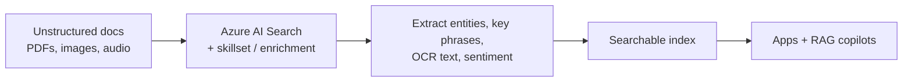
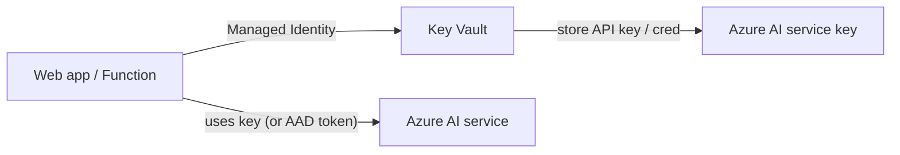
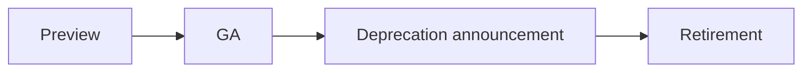

# Extra AI-900 Concepts

> Edge topics that show up in 1-2 questions and don't fit cleanly in the five domains.

## Knowledge Mining (vs Generative AI)

| Pattern | Meaning |
|---|---|
| **Knowledge mining** | Extract structure from unstructured content using **Azure AI Search** with built-in skills (OCR, key phrases, language detect, custom skills). Pre-Gen-AI pattern, still valid. |
| **RAG** | New-school version: vector index + LLM. Replaces or augments knowledge mining for chat-style answers. |

## Azure AI Search vs Cosmos DB vector vs Azure SQL vector

| Need | Pick |
|---|---|
| Hybrid keyword + vector search across many docs, with security trimming + faceting | **Azure AI Search** |
| App already on Cosmos DB and you want vectors next to operational data | **Cosmos DB for NoSQL / Mongo vCore (vector)** |
| App on SQL and you want vectors with relational data | **Azure SQL DB vector support** |

## Anomaly detection options on Azure

| Option | Use |
|---|---|
| **Azure ML - Isolation Forest / one-class SVM** | Train your own anomaly model. |
| **Azure Stream Analytics anomaly detection** | Built-in operators on streaming data. |
| **Application Insights smart detection** | Anomalies in app telemetry - not an exam pick but appears as distractor. |

> Microsoft retired the standalone "Anomaly Detector" service. For new builds, use **Azure ML** or **Stream Analytics**.

## Personalizer (retired) - recognize the name

The standalone "Azure AI Personalizer" service was retired. AI-900 may still mention recommendation patterns conceptually - the modern answer is **Azure AI Foundry agents + your own data + Azure ML**.

## Key Vault + Managed Identity for AI services

- Prefer **Microsoft Entra (Azure AD) tokens** with **Managed Identity** over key-based auth.
- For local prototypes, **Azure AI Foundry / OpenAI** support both.

## Cost basics

- Azure AI services are **consumption-priced** by transaction (image, page, character, token).
- **Azure OpenAI** has **PayGo (per token)** and **Provisioned Throughput Units (PTUs)** for steady high-volume workloads.
- Free tier (F0) exists for most prebuilt services - used in labs.

## Multimodal vs unimodal

- **Unimodal** model handles one type of input (text only / image only).
- **Multimodal** model accepts mixed inputs - e.g., **GPT-4o** takes text + image + audio in one prompt.

## Model lifecycle on Azure OpenAI

- Models eventually retire. Always check current model availability per region.
- **Versioned deployments** let you pin a model version while planning upgrades.

---

[<- References](06-references.md) - [Learn Summaries ->](08-learn-summaries.md)
