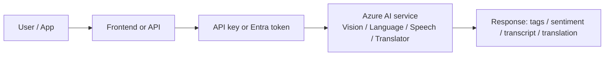
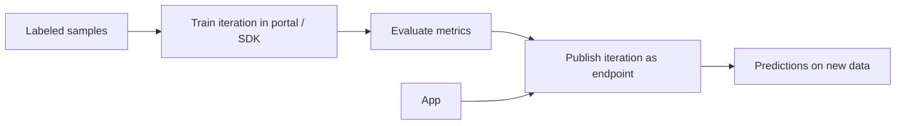
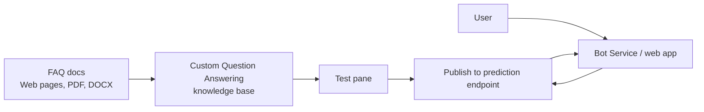
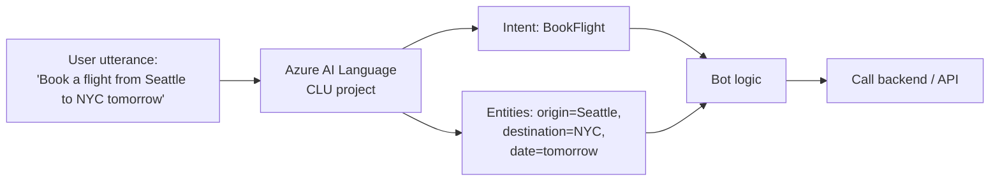
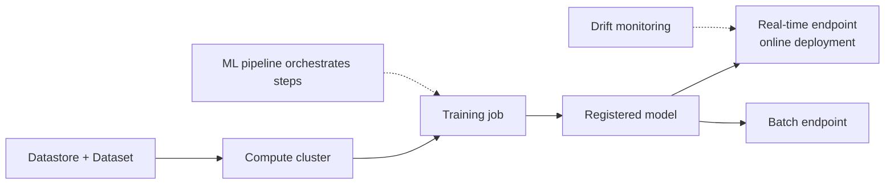
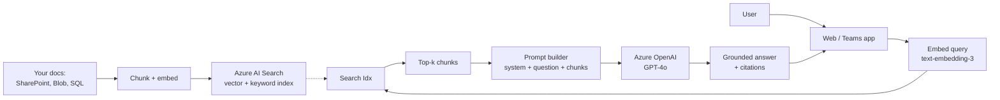
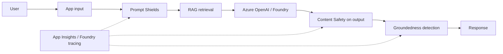
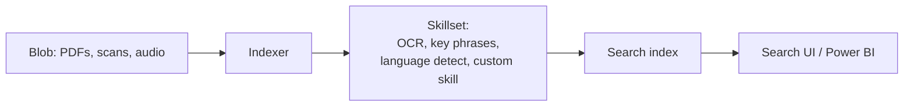
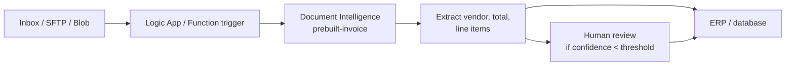
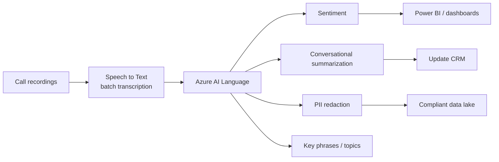

# AI-900 Reference Architectures

> Concept-level architecture diagrams for the patterns AI-900 expects you to recognize. Each diagram is paired with a "what's happening" caption and "when to pick it" cues.

## 1. Prebuilt AI services - single API call

> Pick when an out-of-the-box capability covers the task. No training, no infra.

## 2. Custom Vision (or Custom NER / Custom Translator) - bring your own data

> Pick when prebuilt categories don't fit (your defect classes, your form types, your domain vocabulary).

## 3. Custom Question Answering - FAQ bot

> Pick for "answer questions from a fixed set of policy documents".

## 4. Conversational Language Understanding (CLU) - intent bot

> Pick when the bot needs to recognize *what the user wants to do* and extract structured slots.

## 5. End-to-end Azure ML - train, register, deploy

> Pick for a custom ML model lifecycle.

## 6. RAG - Retrieval Augmented Generation (the canonical Gen AI architecture)

> Pick for "chat over our docs" / "make sure the bot only uses our knowledge".

## 7. Generative AI app - full responsible-AI stack

> Pick when the question mentions multiple safety layers, audit, or governance.

## 8. Knowledge Mining - Azure AI Search with built-in skills

> Pick for "search across millions of unstructured documents". Pre-Gen-AI but still valid.

## 9. Document Intelligence - invoice processing

> Pick for "automate invoice / receipt / ID processing".

## 10. Speech-driven contact center analytics

> Pick when a question chains multiple Azure AI services to analyze calls.

---

[<- Learn Summaries](08-learn-summaries.md) - [Microsoft Resources ->](11-microsoft-resources.md)
